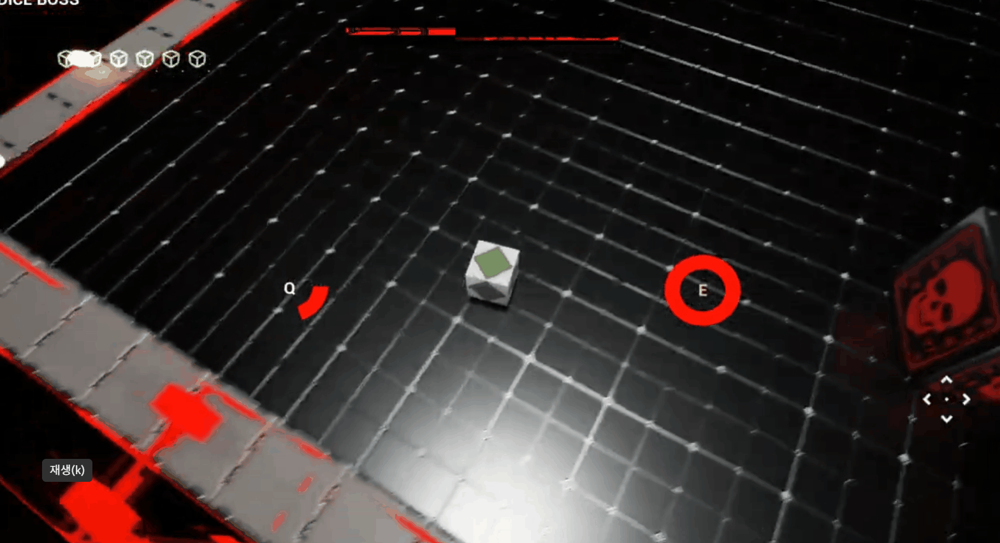

# Dice Shooter 🎲🔫

**"Shoot, Destroy, Rush!"**

몰려오는 주사위 형태의 적을 물리치며 스테이지를 클리어해나가는 쿼터뷰 슈팅 게임입니다.  
언리얼 엔진(Unreal Engine)의 핵심 기능을 익히고, 물리 기반의 화려한 파괴 효과를 구현하는 데 중점을 둔 프로젝트입니다.

\---

## 📺 시연 영상

> 이미지를 클릭하면 유튜브 영상으로 이동합니다.

\---

## 🚀 프로젝트 개요

* **장르**: 쿼터뷰 슈팅 (Quarter-view Shooting)
* **개발 기간**: 2026. 05. 11 \~ 2026. 05. 22 (약 2주)
* **개발 인원**: 1인 개발
* **개발 목표**:

  * 언리얼 엔진 환경 및 C++ 문법 숙달
  * **Chaos Destruction** 기능을 활용한 역동적인 파괴 효과 구현
  * 스테이지 진행부터 보스전까지의 게임 루프 완성

\---

## ✨ 핵심 기능

### 1. Chaos Destruction 기반의 물리 효과

적(주사위)이 파괴될 때 단순한 애니메이션이 아닌, 실시간 물리 조각으로 비산되는 효과를 구현했습니다.

| 적 파괴 효과 |
| :---: |
|  |

### 2. 다양한 보스 패턴

스테이지 마지막에 등장하는 보스는 여러 단계의 공격 패턴을 가집니다.

| 투사체 패턴 | 십자 공격 패턴 |
| :---: | :---: |
|  |  |

\---

## 🛠 기술 스택

* **Engine**: Unreal Engine
* **IDE**: Rider
* **Language**: C++, Blueprints
* **Version Control**: Git, GitHub
* **Special Features**: Chaos Destruction
* **AI Assistant**: Gemini, Gemini CLI

\---

## 📂 주요 에셋

* **Multi Dice Multi Color**: 주사위 모델링 및 텍스쳐
* **Easy Crosshair**: 조준점 UI
* **Super Grid Starter Pack**: 스테이지 환경 구성

\---

## 🔗 관련 링크

* **GitHub Repository**: [https://github.com/redmoon213/miniProject\_GCC](https://github.com/redmoon213/miniProject_GCC)
* **YouTube Demo**: [https://youtu.be/\_1KbW\_1ESfU](https://youtu.be/_1KbW_1ESfU)
* **프로젝트보고서** [https://docs.google.com/document/d/1rOj\_lDPiTS8UidbqpCIl4z-27c8oWP7\_yJ1Zetl03Ik/edit?usp=sharing](https://docs.google.com/document/d/1rOj_lDPiTS8UidbqpCIl4z-27c8oWP7_yJ1Zetl03Ik/edit?usp=sharing)

\---

© 2026 Dice Shooter Project.

